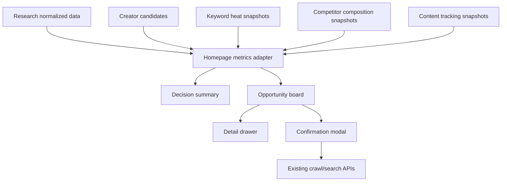

# Boss Dashboard Data Display Design

## Summary

`/research` 首页需要从“功能入口型控制台”升级为“老板可读的增长决策首页”。当前系统已经具备达人发现、内容追踪、关键词热度、友商组成和报告接口，但首页展示仍偏基础统计，不能快速回答“今天该投谁、看哪些词、盯哪个友商、是否值得立即采集”。

本设计采用混合版首页：

- 上半屏展示老板决策摘要。
- 下半屏展示数据监控和综合机会榜。
- 每条机会显示一句核心原因。
- 点击可打开详情抽屉查看完整证据。
- 外部采集动作使用轻量确认弹窗，避免误触发真实平台爬虫。

## Goals

- 让老板打开 `/research` 后 10 秒内看到今天的方向判断。
- 让运营能从首页直接执行：查看详情、加入监控、立即爬取或立即搜索。
- 让每个结论都有证据、置信度和样本量说明。
- 首页保持高信息密度，但不堆满复杂表单。

## Non-Goals

- 本轮不做复杂 BI 自定义看板。
- 本轮不做完整报表导出改造。
- 本轮不做新的生产级权限、审计或审批流。
- 本轮不把所有详情铺在首页，完整证据放入抽屉和对应页面。

## Users

### Boss / Decision Maker

关注：

- 今天有什么机会。
- 哪些达人值得监控。
- 哪些关键词可能被平台推流或限流。
- 哪个友商流量结构变化明显。
- 结论是否可信。

### Operator / Researcher

关注：

- 能否快速进入详情。
- 能否直接加入监控池。
- 能否立即触发搜索或主页采集。
- 能否看到证据解释，避免盲目执行。

## Display Principles

### Mixed Decision Tone

首页采用混合口径：

- 主结论偏老板汇报，给方向判断。
- 证据层保持保守，样本不足必须明确提示。
- 行动层给运营可执行动作。

### Multi-Window View

默认展示两个时间窗口：

- `24h`: 判断短期变化和平台推流敏感度。
- `7d`: 判断阶段趋势，减少短期噪声。

详情抽屉展示：

- `30d`: 作为长期基线和趋势参考。

### Balanced Opportunity Score

综合机会分由四类信号均衡组成：

- 关键词机会：30%
- 达人机会：30%
- 友商变化：20%
- 内容机会：20%

权重理由：

- 当前业务入口是“关键词筛达人”和“平台推流判断”，所以关键词和达人略高。
- 友商和内容作为验证与执行参考。

## Homepage Layout

### Header

保留当前顶部：

- 全局搜索。
- 数据服务状态。
- 同步时间。
- 通知入口。
- 用户入口。
- 配置入口。

### First Screen: Decision Summary

左侧：今日增长判断。

展示字段：

- 主结论。
- 综合置信度。
- 样本量状态。
- 风险提示。
- 主要证据来源数量。

示例：

```text
今日判断：K12教育 + 单亲妈妈方向有短期升温迹象，建议优先筛选高匹配达人并观察小红书内容反馈。
置信度：中
样本量：24h 内容 126 条，7d 平均 84 条
风险：样本仍集中在小红书，抖音样本不足。
```

右侧：今日行动建议。

分三组展示：

- 立刻执行。
- 今天观察。
- 暂缓动作。

每条建议包含：

- 标题。
- 一句原因。
- 入口按钮。

### Lower Screen: Monitoring + Opportunity Board

下半屏由两个区域组成：

#### Data Monitoring Cards

展示：

- 采集任务状态。
- 今日采集量。
- 异常数。
- 监控池数量。
- 实时发现任务状态。
- 数据更新时间。

#### Comprehensive Opportunity Board

表格或紧凑列表展示综合机会。

每行字段：

- 类型：达人 / 关键词 / 友商 / 内容。
- 名称。
- 总机会分。
- 24h 变化。
- 7d 趋势。
- 置信度。
- 一句核心原因。
- 操作按钮。

操作按钮：

- 查看详情。
- 加入监控。
- 立即爬取 / 立即搜索。

## Opportunity Types

### Creator Opportunity

来源：

- 达人候选池。
- 账号画像。
- 监控池状态。
- 近期内容表现。

展示指标：

- 匹配分。
- 活跃度。
- 近 30 天发帖数。
- 平均互动率。
- 爆款率。
- 粉丝数。
- 是否已监控。

一句解释示例：

```text
主词命中且近 30 天持续发帖，互动率高于同池均值。
```

操作：

- 查看详情。
- 加入监控池。
- 加入并立即爬取。

### Keyword Opportunity

来源：

- 关键词热度快照。
- 关键词机会计算。
- 规则 + AI 双轨判断。
- 内容和评论命中。

展示指标：

- 热度分。
- 24h 增长。
- 7d 趋势。
- 供给缺口。
- 平台信号。
- 规则判断。
- AI 判断。
- 冲突标记。

一句解释示例：

```text
24h 内容量高于 7d 均值，互动增长同步上升，规则判断为推流增强。
```

操作：

- 查看详情。
- 加入场景包或监控关键词。
- 立即搜索。

### Competitor Opportunity

来源：

- 友商账号。
- 组成快照。
- 内容互动。
- 高爆款内容。

展示指标：

- 总互动变化。
- 新增内容数。
- 爆款率。
- 关键词占比变化。
- 内容类型变化。
- 发布时间分布。
- 互动结构。

一句解释示例：

```text
友商近 24h 爆款率提升，流量集中在升学规划和单亲陪读话题。
```

操作：

- 查看详情。
- 加入友商监控。
- 立即重建组成快照。

### Content Opportunity

来源：

- 内容追踪器。
- 同类内容候选。
- 关键词命中。
- 相似内容分析。

展示指标：

- 相似度。
- 命中关键词。
- 互动量。
- 内容类型。
- 发布时间。
- 可复用结构。

一句解释示例：

```text
同类内容集中在陪读焦虑场景，标题模式重复出现且互动稳定。
```

操作：

- 查看详情。
- 创建内容追踪器。
- 立即搜索同类内容。

## Detail Drawer

点击“查看详情”打开右侧抽屉。

抽屉结构：

- 基础信息。
- 24h / 7d 摘要。
- 30d 趋势。
- 证据列表。
- 相关内容 / 达人 / 关键词 / 友商。
- 操作区。

证据列表字段：

- 来源。
- 证据文本。
- 指标值。
- 时间。
- 关联对象。

详情抽屉不替代独立页面。抽屉用于快速判断，复杂编辑仍跳转到：

- 人群筛选页。
- 内容追踪页。
- 友商监控页。
- 关键词热度页。
- 报告中心。

## Lightweight Confirmation Modal

所有外部采集动作必须弹出轻量确认。

触发场景：

- 达人立即爬取。
- 关键词立即搜索。
- 友商组成快照重建。
- 内容同类实时搜索。

不触发场景：

- 本地数据分析。
- 查看详情。
- 加载历史快照。

弹窗展示：

- 平台。
- 关键词 / 达人 / 友商账号。
- 动作类型。
- 是否采集评论。
- 预计创建或复用的任务。
- 风险提示。

按钮：

- 取消。
- 确认执行。

## Data Flow



## Backend Needs

Prefer a homepage aggregation endpoint to avoid many frontend calls.

Suggested endpoint:

```text
GET /api/reports/dashboard-summary?vertical_id=&scene_pack_id=&platform=
```

Response shape:

```json
{
  "decision": {
    "headline": "...",
    "confidence": "medium",
    "sample_status": "enough|limited|insufficient",
    "risk_notes": []
  },
  "actions": {
    "do_now": [],
    "watch_today": [],
    "defer": []
  },
  "monitoring": {
    "running_jobs": 0,
    "today_collected": 0,
    "errors": 0,
    "monitor_pools": 0
  },
  "opportunities": []
}
```

Opportunity item shape:

```json
{
  "id": "keyword:xhs:K12教育",
  "type": "keyword",
  "name": "K12教育",
  "platform": "xhs",
  "score": 86.5,
  "change_24h": 18.2,
  "trend_7d": 9.4,
  "confidence": "medium",
  "reason": "24h 内容量高于 7d 均值，互动增长同步上升。",
  "evidence_count": 6,
  "actions": ["view_detail", "monitor", "crawl_now"],
  "payload": {}
}
```

## Frontend Needs

Update `api/webui/src/main.tsx` or split into smaller files if the edit becomes risky.

Needed components:

- `DecisionSummaryPanel`
- `ActionSuggestionPanel`
- `MonitoringCards`
- `OpportunityBoard`
- `OpportunityDetailDrawer`
- `ConfirmExecutionModal`

The existing homepage can keep the current shell and navigation. Replace the current growth overview body with the new mixed dashboard.

## Error Handling

- If samples are insufficient, show “样本不足”，not a forced conclusion.
- If backend aggregation fails, homepage should still show current monitoring cards and a recoverable error state.
- If external crawl action fails, keep modal open with error message and no duplicate execution.
- If opportunity payload lacks action target, disable the relevant action and show why.

## Testing

Backend:

- Dashboard summary returns decision, actions, monitoring, opportunities.
- Opportunity score ordering is deterministic.
- Sample-insufficient state returns conservative copy.
- Opportunity items include action payload and reason.

Frontend:

- `/research` first screen renders summary and opportunity board.
- Opportunity detail drawer opens and closes.
- External crawl action opens confirmation modal.
- Cancel does not call API.
- Confirm calls the correct existing API.
- Empty state does not overflow or show fake data.

## Rollout

1. Add backend dashboard aggregation.
2. Add frontend types and API call.
3. Replace homepage body with mixed dashboard.
4. Add detail drawer.
5. Add confirmation modal.
6. Run backend tests and `npm run build`.

## Open Decisions

No unresolved product decisions remain for this design. Initial defaults:

- Homepage mode: mixed decision + monitoring.
- Tone: boss-facing headline, conservative evidence, operator actions.
- Time windows: 24h and 7d on homepage, 30d in drawer.
- Ranking: balanced composite score.
- Row explanation: one sentence.
- Actions: view detail, monitor, crawl/search now.
- External execution: lightweight confirmation modal.
