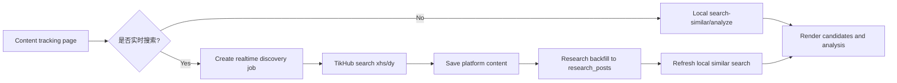

# Content Tracking Realtime Search Design

## Context

The content tracking page currently searches evidence from the local research database. The frontend calls `/api/content-tracking/search-similar` and `/api/content-tracking/analyze`; the backend reads `research_posts` through `ResearchRepository.list_all_posts(...)`, then ranks candidates with `search_similar_content(...)`.

The project already has TikHub integration pieces:

- `media_platform/tikhub/client.py` resolves `TIKHUB_API_KEY` and calls TikHub.
- `media_platform/tikhub/endpoints.py` defines search endpoints for `xhs` and `dy`.
- `media_platform/tikhub/core.py` maps TikHub search results and saves platform content.
- `api/routers/content_tracking.py` already contains a `realtime-discovery` route that schedules a research job, but the page does not currently use this path.

## Goal

Add an optional realtime search path to the content tracking page. When enabled, the page should search TikHub for Xiaohongshu and Douyin content, save the results into the existing database pipeline, then refresh the local similar-content results.

The default behavior remains unchanged: if realtime search is not enabled, the page searches only the local database.

## User Experience

Add a checkbox on the content tracking source/search panel:

- Label: `是否实时搜索`
- Default: unchecked
- Meaning when unchecked: use current local database search.
- Meaning when checked: search TikHub first, save results, then refresh local candidates.

The existing search button remains the primary action. When realtime search is checked, its label can change from `搜索同类内容` to `实时搜索并入库`.

### Platform Scope

Realtime search is temporarily limited to Xiaohongshu and Douyin:

- Platform = `xhs`: realtime search only Xiaohongshu.
- Platform = `dy`: realtime search only Douyin.
- Platform = `all`: realtime search Xiaohongshu and Douyin.
- Platform = any other value: realtime search is disabled or rejected with a clear message: `实时搜索暂只支持小红书和抖音`.

Local database search should still work for every existing platform.

## Progress Interaction

Realtime search needs a visible progress bar and stage text because TikHub calls and database import can take several seconds.

Use stage-based progress rather than fake exact progress. Initial MVP stages:

1. `准备实时搜索` at 10%.
2. `正在搜索小红书/抖音` at 35%.
3. `正在写入内容库` at 65%.
4. `正在刷新本地结果` at 85%.
5. `搜索完成` at 100%.

If multiple platforms run, the stage text should include platform-level detail when available, for example `正在搜索小红书` then `正在搜索抖音`.

If backend progress is not yet observable in detail, the frontend may show deterministic staged progress while waiting for the job, but it must not claim exact item counts until the backend returns them.

Success state:

- Show imported count if available.
- Show matched candidate count.
- Keep the returned candidates visible in the existing results area.

Failure state:

- TikHub key missing, auth failure, balance/permission failure, rate limit, timeout, and upstream validation errors should be shown as explicit messages.
- Existing local results should not be cleared on realtime failure.
- If realtime import fails after some content was saved, the response should indicate partial completion when the backend can know it.

## Backend Design

Preferred backend flow:

1. Frontend sends the selected keywords, platform selection, and `realtime: true`.
2. Backend validates that realtime platforms resolve to only `xhs` and/or `dy`.
3. Backend creates a `content_realtime_discovery` research job.
4. The job uses TikHub search capability for each keyword and platform.
5. TikHub results are mapped through the existing platform mappers and saved through existing stores.
6. Research backfill writes imported content into `research_posts`.
7. Backend reruns `search_similar_content(...)` against the refreshed local data.
8. Backend returns candidates plus realtime metadata.

The route may reuse the existing `/api/content-tracking/realtime-discovery` and `/api/content-tracking/discovery/{job_id}/wait-refresh` endpoints, or fold this into `/api/content-tracking/search-similar` behind a `realtime` request flag. The implementation should prefer the smallest change that keeps the frontend flow simple.

Recommended response metadata:

```json
{
  "realtime": {
    "enabled": true,
    "job_id": 123,
    "platforms": ["xhs", "dy"],
    "status": "completed",
    "imported_count": 18,
    "matched_count": 12,
    "errors": []
  },
  "candidates": []
}
```

## Frontend Design

Add state to `ContentTrackingPage`:

- `realtimeSearchEnabled`
- `realtimeProgress`
- `realtimeStage`
- `realtimeMetadata`

Update `runLocalSearch` so it branches:

- `realtimeSearchEnabled === false`: current behavior.
- `realtimeSearchEnabled === true`: start realtime discovery, show progress, wait for refresh, then update candidates/comments/summary as today.

For MVP, the progress bar can be local stage-based UI around the existing backend calls. If the backend later exposes progress events or status details, the frontend can replace the local staged progress with actual job progress.

## Data Flow



## Error Handling

Validation errors:

- No keywords selected: keep the existing frontend validation.
- Realtime enabled for unsupported platform: show `实时搜索暂只支持小红书和抖音`.
- No resolved realtime platform: block the request.

TikHub errors:

- Missing API key: tell the user to configure `TIKHUB_API_KEY` in the backend environment and restart the backend.
- Auth/balance/permission failure: show the backend error in a user-readable form.
- Rate limit: show a retry-later message.
- Timeout/upstream failure: show that realtime search failed and keep local results.

Job errors:

- If a research execution is already running, show busy status and do not start a second realtime job.
- If the job times out while waiting, keep the job id in the response where possible so the UI can tell the user the task may still be running.

## Testing

Backend tests:

- Realtime platform resolution: `all` becomes `["xhs", "dy"]`; `xhs` and `dy` stay single-platform; unsupported platforms are rejected.
- Realtime-off path still returns local candidates exactly as before.
- Missing TikHub key returns a clear error.
- Busy research execution returns a clear busy response.

Frontend tests or manual checks:

- Checkbox unchecked keeps current local search behavior.
- Checkbox checked changes button label and shows progress.
- `all` searches Xiaohongshu and Douyin.
- Unsupported platform disables realtime or shows the unsupported message.
- Failure does not clear existing candidates.

## Rollout

Build this as a synchronous-wait MVP first. The user clicks search, sees a stage-based progress bar, and receives refreshed candidates when the backend finishes or times out.

If TikHub search latency becomes too high, upgrade to a full background job UX with polling:

- Start job.
- Poll `/api/content-tracking/discovery/{job_id}/status`.
- Show job status and platform stage.
- Refresh candidates after completion.
